# How to Set Up The Forgotten Server (TFS) on Windows

This guide will walk you through setting up The Forgotten Server (TFS) 1.2 on Windows, including the server, web panel (MyAAC), and client configuration.

## Prerequisites

- Windows operating system
- The Forgotten Server 1.2 (`forgottenserver-1.2.zip`)
- MyAAC (`myaac-main.zip`)
- OTClient V8 (`otclientv8-master.zip`)
- UniServerZ (will be downloaded during setup)

## Step 1: Extract and Configure The Forgotten Server

### Extract the Server Files

Extract `forgottenserver-1.2.zip`. If the folder is already extracted, place it on the C: drive.

It should look like this:

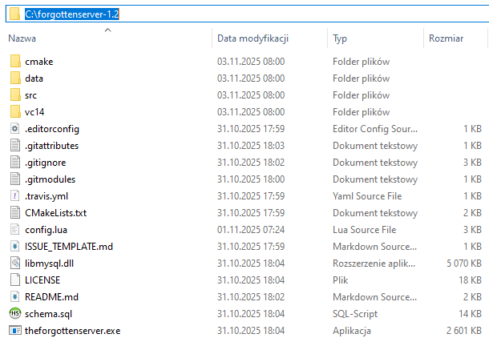

### Configure the Server

1. Open `config.lua` with Notepad.
2. Find the MySQL configuration section.

   Replace `#dbpass#` and `#dbname#` with values of your choice. The `#` symbols are just markers for easy identification and should be removed when entering your values.

   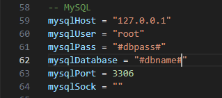

3. Below the database configuration, you can find the experience rate (`exprate`). You can modify this value if desired.

   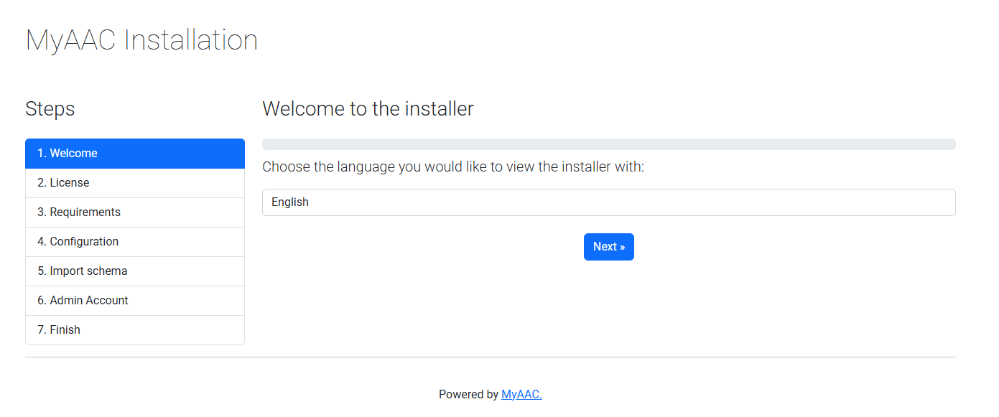

## Step 2: Install and Configure UniServerZ

### Download and Install UniServerZ

1. Download UniServerZ from [https://www.uniformserver.com/](https://www.uniformserver.com/)
2. Install it in the following path: `C:\UniServerZ\`
3. Run UniServerZ.

   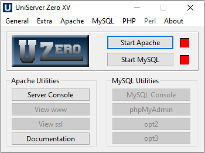

### Change MySQL Password

1. Navigate to **MySQL > Change MySQL Password**.
2. Set the password to the same value as `#dbpass#` used previously in `config.lua`.

   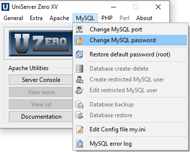

### Enable PHP Modules

1. Navigate to **PHP > Edit Basic and Modules > PHP Modules Enable / Disable**.

   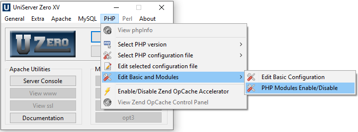

2. Ensure the following modules are enabled:
   - `bz`
   - `com_dotnet`
   - `curl`
   - `exif`
   - `gd`
   - `ldap`
   - `mbstring`
   - `openssl`
   - `pdo_mysql`
   - `sockets`
   - `sysvshm`
   - `zip`

## Step 3: Set Up MyAAC Web Panel

### Extract MyAAC Files

1. Navigate to the folder where you installed UniServerZ.
2. Locate the `www` folder.
3. Delete all files from the `www` folder.
4. Extract `myaac-main.zip` contents into the `www` folder.

   The folder should look like this:

   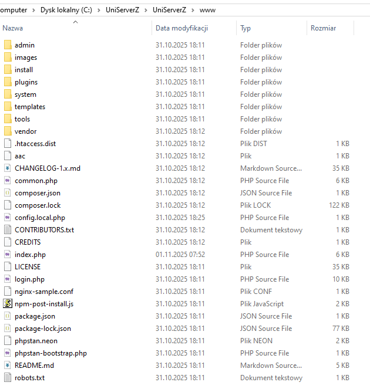

### Start Services

Start Apache and MySQL from the UniServerZ control panel.

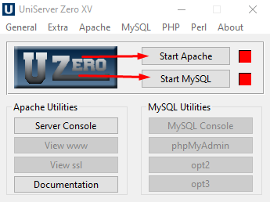

## Step 4: Create Database

### Access phpMyAdmin

1. Open phpMyAdmin from the UniServerZ control panel.

   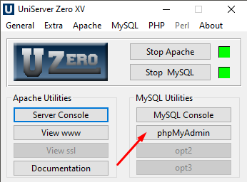

### Create New Database

1. Create a new database using the same name as `#dbname#` used previously in `config.lua`.

   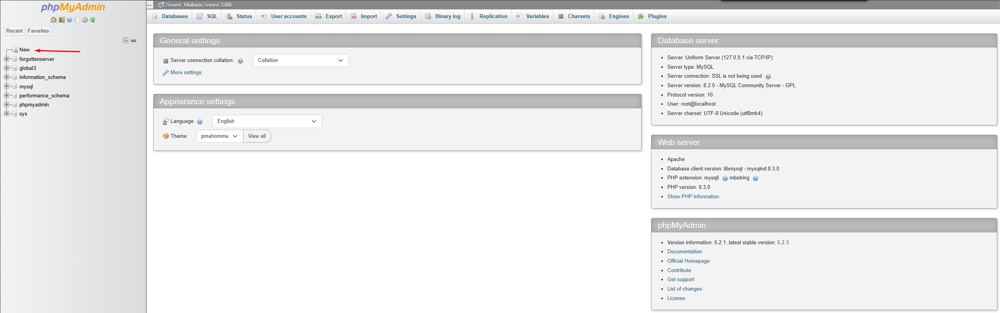

2. Enter the database name and click **Create**.

   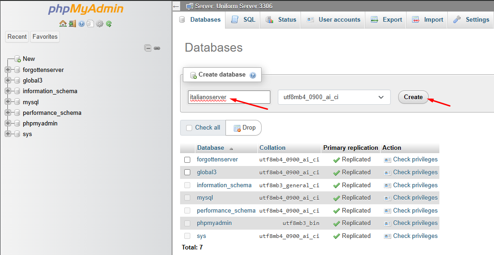

### Import Server Schema

1. Navigate to the **Import** tab.
2. Ensure you are in the database folder.
3. Click **Choose File** and select `schema.sql` from the server folder (located in `C:\forgottenserver-1.2`).

   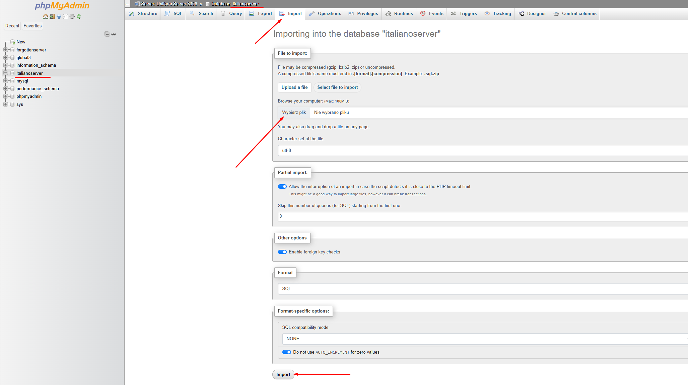

## Step 5: Install MyAAC

### Run the Installation Wizard

1. Navigate to: `http://127.0.0.1/install/`

   

2. Verify that all requirements are marked in green.

   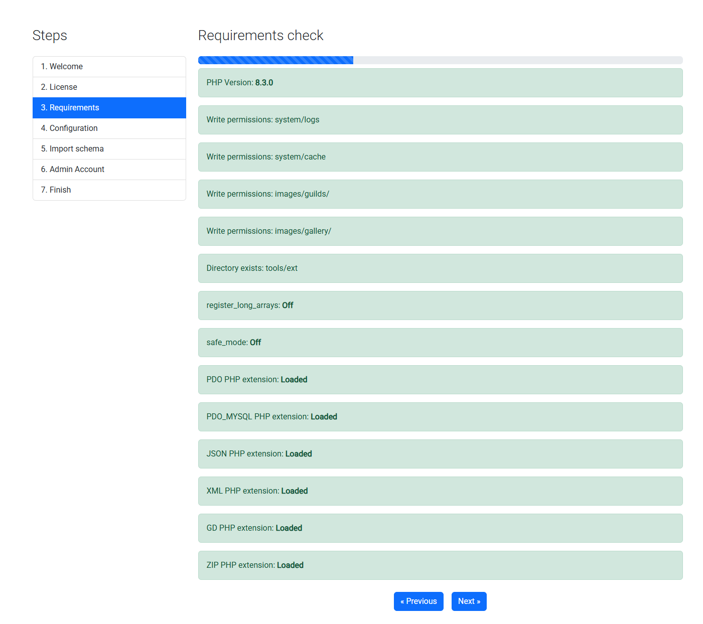

3. Fill in the server path: `C:\forgottenserver-1.2`
4. Select client version: **10.98**

   

5. Import the schema.
6. Create your admin account.

   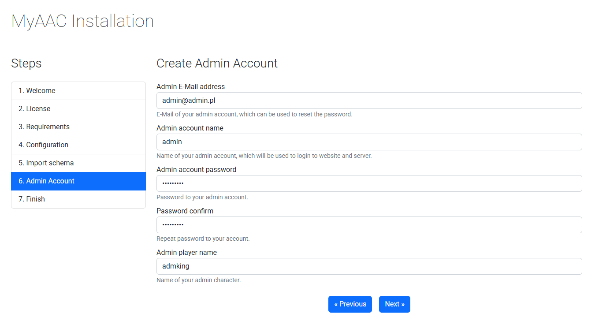

7. The MyAAC installation is now complete!

   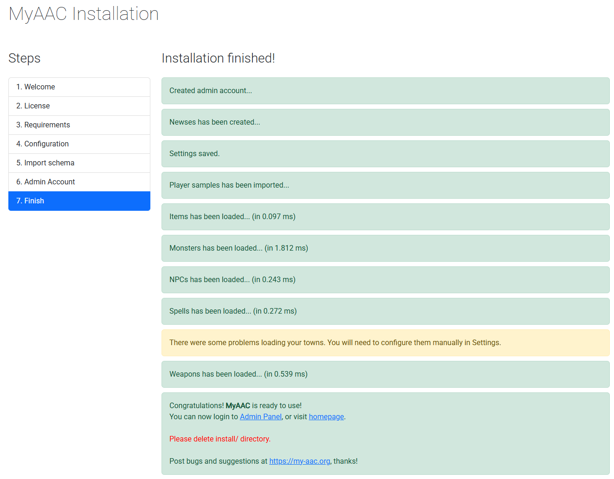

## Step 6: Create a Character

1. Go to `http://127.0.0.1` in your browser. You should see the MyAAC homepage.

   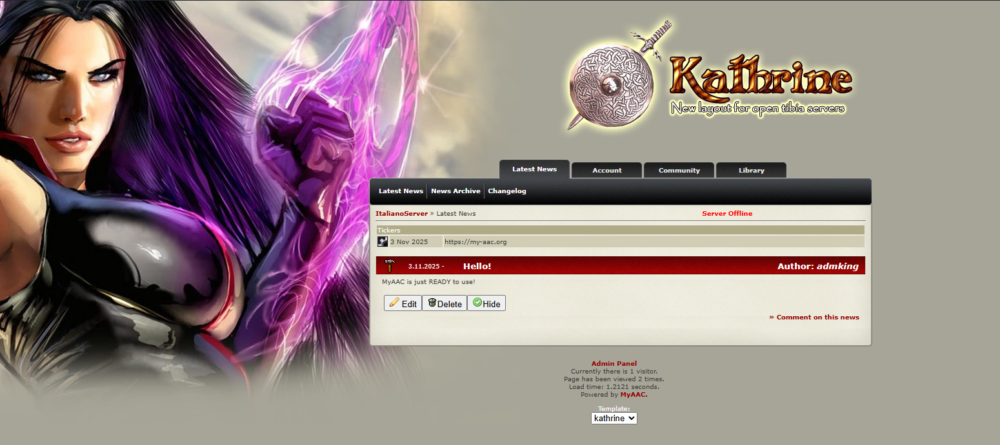

2. Navigate to: `http://127.0.0.1/index.php/account/characters/create`
3. You can now create your first character.

## Step 7: Start the Server

1. Run `forgottenserver.exe` from the `C:\forgottenserver-1.2` folder.

   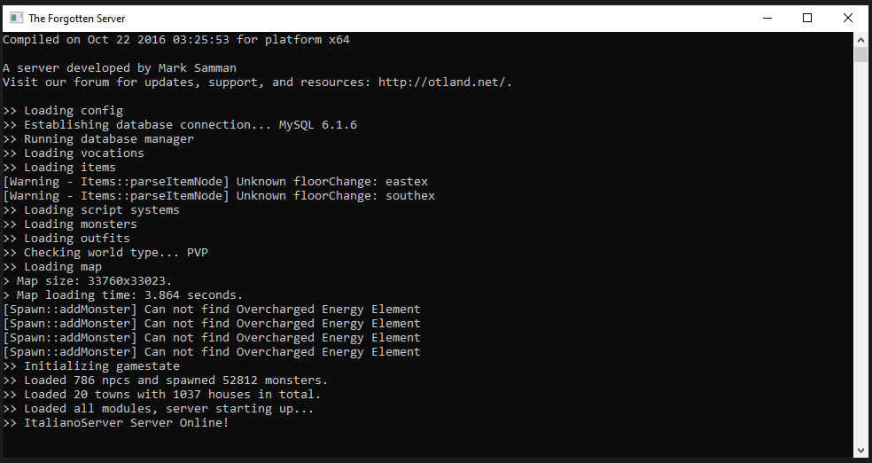

2. The server is now ready to play!

## Step 8: Connect with the Client

1. Run `otclient_gl.exe` from the `otclientv8-master` folder.
2. Fill in the fields with your created admin account credentials.

   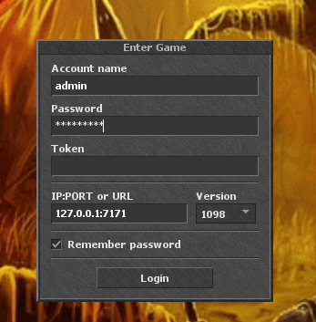

3. After logging in, you will be able to see your characters.

   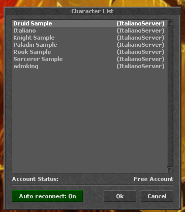

4. Select your character and enjoy playing!

   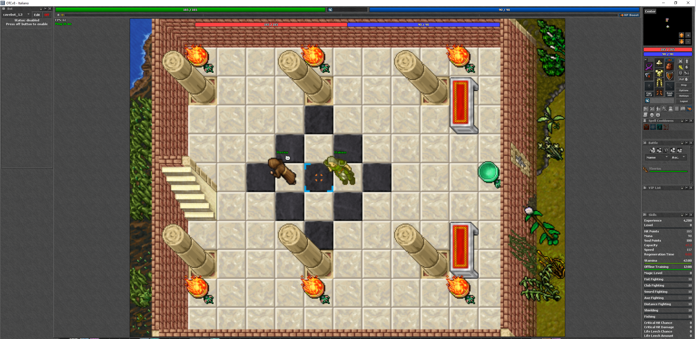
   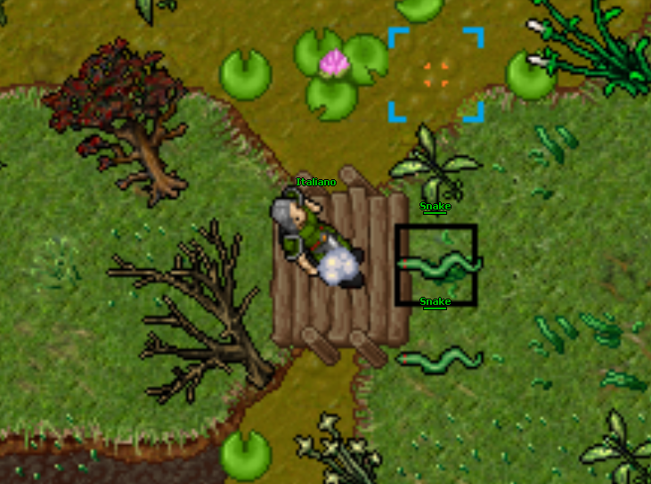

## Conclusion

Congratulations! You have successfully set up The Forgotten Server on Windows with MyAAC web panel and connected using OTClient V8. Your server is now running and ready for gameplay.

---

If you enjoyed this article, you can support me by buying me a coffee!

## Credits and Attribution

**Important Disclaimer:** All sprites, textures, and game content used in this setup are the property of **CipSoft GmbH**. I do not claim ownership of any game assets or content. This guide only combines existing open-source tools and software into a comprehensive tutorial. I only created this documentation and combined everything into one guide.

### Open Source Projects Used

Special thanks to the developers and contributors of the following open-source projects used in this guide:

- **The Forgotten Server**: [https://github.com/otland/forgottenserver](https://github.com/otland/forgottenserver)
- **OTClient V8**: [https://github.com/OTCv8/otclientv8](https://github.com/OTCv8/otclientv8)
- **MyAAC**: [https://github.com/slawkens/myaac](https://github.com/slawkens/myaac)
- **World Map**: [https://github.com/orts/world](https://github.com/orts/world)

### Game Content Ownership

All game assets, including sprites, textures, and game content, are owned by **CipSoft GmbH**. This tutorial is for educational purposes only and simply provides a step-by-step guide to combine the open-source tools mentioned above.

